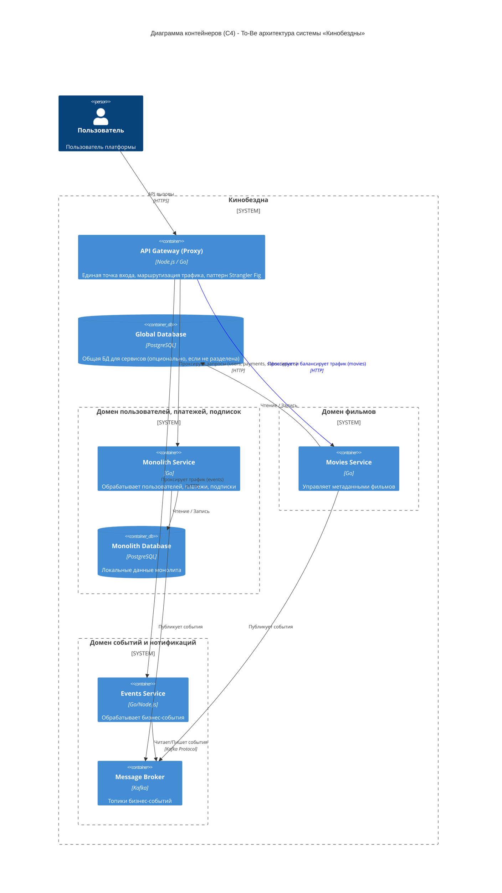

```mermaid
C4Container
    title Диаграмма контейнеров (C4) - To-Be архитектура системы «Кинобездны»

    Person(user, "Пользователь", "Пользователь платформы")

    System_Boundary(c1, "Кинобездна") {
        Container(proxy, "API Gateway (Proxy)", "Node.js / Go", "Единая точка входа, маршрутизация трафика, паттерн Strangler Fig")
        
        System_Boundary(monolith_domain, "Домен пользователей, платежей, подписок") {
            Container(monolith, "Monolith Service", "Go", "Обрабатывает пользователей, платежи, подписки")
            ContainerDb(monolith_db, "Monolith Database", "PostgreSQL", "Локальные данные монолита")
        }
        
        System_Boundary(movies_domain, "Домен фильмов") {
            Container(movies_service, "Movies Service", "Go", "Управляет метаданными фильмов")
        }
        
        System_Boundary(events_domain, "Домен событий и нотификаций") {
            Container(events_service, "Events Service", "Go/Node.js", "Обрабатывает бизнес-события")
            Container(kafka, "Message Broker", "Kafka", "Топики бизнес-событий")
        }
        
        ContainerDb(shared_db, "Global Database", "PostgreSQL", "Общая БД для сервисов (опционально, если не разделена)")
    }

    Rel(user, proxy, "API вызовы", "HTTPS")
    
    Rel_R(proxy, monolith, "Проксирует запросы (users, payments, subscriptions)", "HTTP")
    Rel_R(proxy, movies_service, "Проксирует и балансирует трафик (movies)", "HTTP")
    Rel_R(proxy, events_service, "Проксирует трафик (events)", "HTTP")

    Rel(monolith, monolith_db, "Чтение / Запись")
    Rel(movies_service, shared_db, "Чтение / Запись")
    
    Rel(monolith, kafka, "Публикует события")
    Rel(movies_service, kafka, "Публикует события")
    
    Rel_R(events_service, kafka, "Читает/Пишет события", "Kafka Protocol")
    
    UpdateRelStyle(proxy, movies_service, $textColor="blue", $lineColor="blue", $offsetX="5")
```